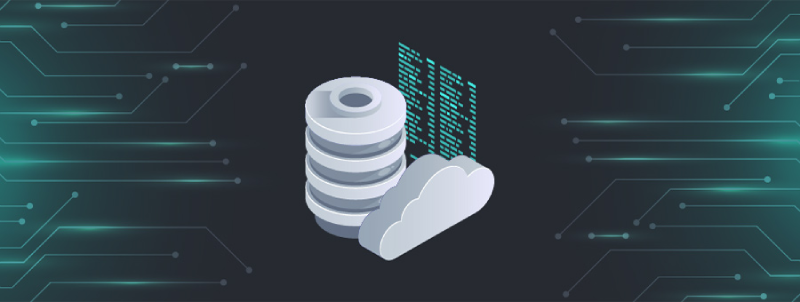

# Componentes da Arquitetura SGBD

> **ATIVIDADE**: Descreva quais são os principais componentes da arquitetura do SGBD, e qual a sua principal funcionalidade.

Os componentes de um SGBD são a estrutura lógica básica para que o sistema consiga realizar a integração com um tipo específico de banco de dados. Por isso, veja qual é o papel de cada componente, a seguir.

### Pré-compilador DML
É o primeiro passo de um SGBD. No pré-compilador, o SGBD começa a identificar a sintaxe do DML (Linguagem de Manipulação de Dados) e realiza as chamadas proceduralmente.

### Compilador DML
Aqui o compilador realiza a tradução do DML para a linguagem de baixo nível e as operações são feitas.

### Interpretador DDL
O interpretador de DDL (Linguagem de Definição de Dados) funciona para gerenciar as tabelas e seus dados.

### Gerenciador de autorização
Como o próprio nome já diz, é o gerenciador que verifica se a pessoa usuária atual tem permissão para realizar tal tarefa.

### Gerenciador de integridade
Verifica a integridade do banco de dados quando uma operação é realizada.

### Gerenciador de transição
Controla tanto o acesso simultâneo de várias pessoas usuárias, como também a integridade antes e depois de uma operação no banco de dados.

### Gerenciador de arquivos
Gerencia o espaço de disco do banco de dados e a sua estrutura de arquivos.

### Gerenciador de buffer
É o responsável pela memória em cache e também coordena a transferência de dados do banco de dados principal com o secundário.

## Resposta usando IA 
Um Sistema de Gerenciamento de Banco de Dados (SGBD) é um software projetado para gerenciar o armazenamento, recuperação, manipulação e segurança de informações em um banco de dados. A arquitetura de um SGBD é composta por vários componentes interconectados que trabalham juntos para garantir o funcionamento eficiente e confiável do sistema. Os principais componentes da arquitetura de um SGBD são:

1. **Usuários e Aplicativos**: Essa camada representa os usuários finais e as aplicações que interagem com o banco de dados. Os usuários podem ser divididos em diferentes categorias, como administradores, desenvolvedores e usuários comuns. As aplicações podem ser sistemas de processamento de transações, aplicativos de relatórios, interfaces web, entre outros.
2. **Gerenciador de Consultas**: Este componente é responsável pelo processamento de consultas SQL e a otimização das consultas para garantir uma recuperação eficiente dos dados. Ele traduz as consultas escritas pelos usuários em um plano de execução otimizado, que é executado pelo Sistema de Execução.
3. **Otimizador de Consultas**: O otimizador é uma parte crucial do SGBD que analisa as consultas escritas pelos usuários e decide qual plano de execução é mais eficiente em termos de tempo e recursos. Ele utiliza informações sobre a estrutura do banco de dados, índices e estatísticas para tomar essa decisão.
4. **Dicionário de Dados**: Também conhecido como catálogo, o dicionário de dados é uma coleção de metadados que descrevem a estrutura do banco de dados. Ele armazena informações sobre tabelas, colunas, índices, restrições, permissões e outros objetos do banco de dados. Isso permite que o sistema saiba como os dados estão organizados e como eles podem ser acessados.
5. **Gerenciador de Armazenamento**: Este componente é responsável por gerenciar o armazenamento físico dos dados no disco. Ele lida com a alocação de espaço em disco, gerenciamento de páginas, gerenciamento de buffer (cache), controle de concorrência e recuperação em caso de falhas.
6. **Motor de Execução**: O motor de execução é responsável por executar os planos de execução gerados pelo gerenciador de consultas. Ele interage com o gerenciador de armazenamento para recuperar os dados necessários, aplicar filtros, ordenações e outras operações especificadas na consulta.
7. **Controlador de Transações**: Transações são operações que envolvem uma ou mais mudanças nos dados do banco de dados. O controlador de transações garante que essas operações sejam realizadas de forma consistente e durável, seguindo o conceito ACID (Atomicidade, Consistência, Isolamento e Durabilidade).

### Resumo
A principal funcionalidade de um SGBD é gerenciar de maneira eficiente e segura o acesso aos dados armazenados em um banco de dados. Ele fornece um ambiente controlado para criação, armazenamento, recuperação e manipulação de dados, garantindo que os dados estejam organizados, acessíveis e protegidos contra falhas e acessos não autorizados. Além disso, o SGBD oferece recursos de otimização de consultas para melhorar o desempenho das operações de recuperação e manipulação de dados.

---
**Outros Formatos:**
- [Google Docs](https://docs.google.com/document/d/1OL65gPnabAuqAL2I3rdhP4ch42OOknkLLZgjkoSgSf0/edit?usp=sharing)

**Referências:**
- [Betrybe - SGBD: o que é, como funciona a arquitetura](https://blog.betrybe.com/tecnologia/sgbd-tudo-sobre/)
- [ChatGPT](https://chat.openai.com/)